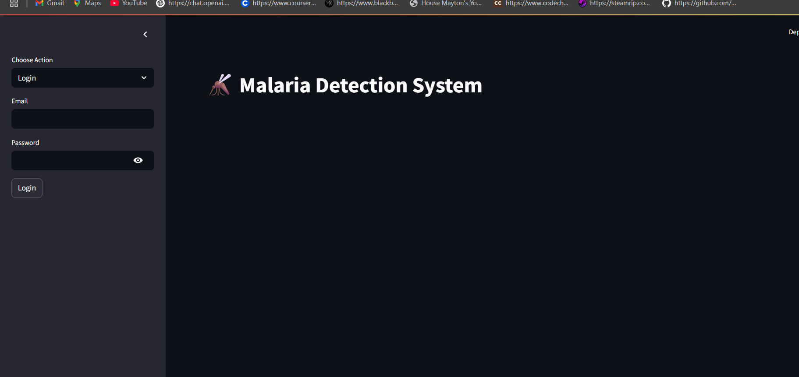
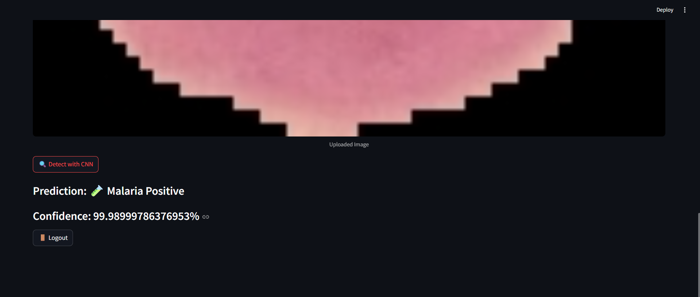
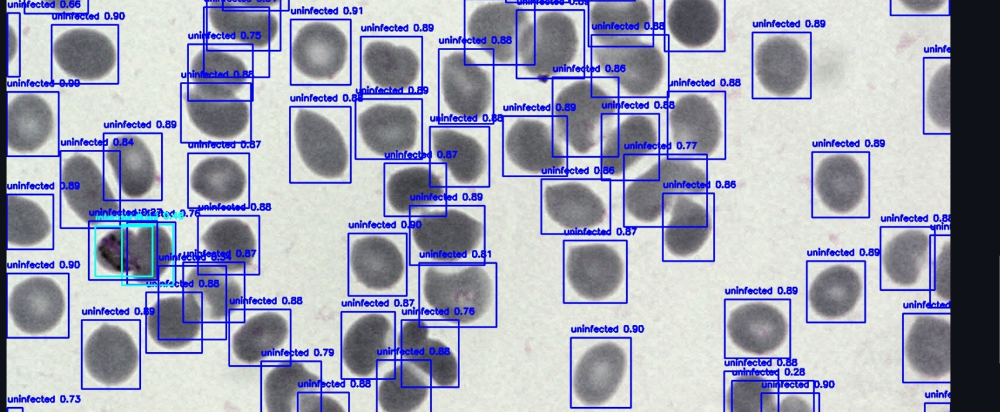

# 🦟 Malaria Detection System

This web app allows users to detect malaria from blood smear images using two models:

- 📷 **Single Cell Detection (CNN Model)** for individual cell prediction.
- 🧪 **Multiple Cell Detection (YOLOv5 Model)** for scanning full smear images and locating infected cells.

## 🔐 Authentication
Uses Firebase email/password login system to secure user access.

---

## 💻 Features

- Streamlit Web Interface
- Upload and analyze images in two detection modes
- Model selection: CNN for single cells, YOLOv5 for full image scan
- Bounding box predictions with confidence scores
- Custom trained YOLOv5 model on BBBC041 dataset

---

## 🧠 Model Architecture

- **YOLOv5s**: Trained on BBBC041 dataset to detect infected/uninfected cells.
- **CNN Model**: Keras-based classifier trained on cropped cell images.

---

## 🖼 Sample Screenshots

### Login Interface


### CNN Detection (Single Cell)


### YOLOv5 Detection (Multiple Cells)


---

## 📦 Installation

```bash
git clone https://github.com/zaidjavedsyed/Malaria-Detection.git
cd Malaria-Detection
python -m venv venv
venv\Scripts\activate
pip install -r requirements.txt
streamlit run app.py
